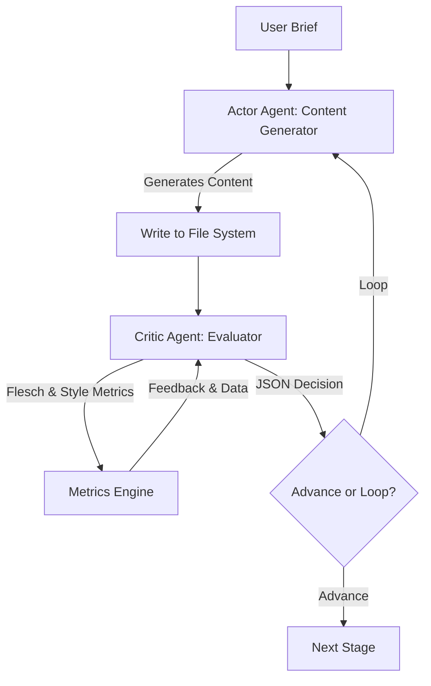

# Quill Architectural & Design Review

## Executive Summary

Quill is an elegant, modular writing workflow engine designed to orchestrate long-form content generation. By breaking down writing into atomic stages (Outline, Draft, Review, Revise, Humanize, Validate, Polish), the system avoids the limitations of single-prompt "dump 10K words" models and implements an iterative feedback loop.

### Overall Architecture Rating: **B+**
Quill's core structure is highly robust and clean. Storing piece history as separate markdown files inside a dedicated output folder acts as a local Git-like state manager. The decoupling of LLM API calls via a zero-dependency `urllib` client and the use of mechanical, offline metrics computation are outstanding design choices. 

However, there is a **significant mismatch** between the documented "two-call approach" (Actor-Critic) and the actual "single-call" separator-based implementation in the runner. Additionally, the application blocks Flask worker threads during long LLM execution runs, and pipeline-stage inputs are hardcoded in the Python code rather than defined in the workflow configurations.

---

## 1. Architectural Highlights (What Quill Does Well)

### 📂 Directory-per-Piece & File-Based State
Storing each stage as an independent markdown file (e.g., [Piece Loader](file:///home/bob/projects/quill/src/quill/piece.py)) is a stellar decision. 
* **Auditability**: Users can inspect the exact progression of a piece stage-by-stage.
* **Loss Prevention**: If a step loops back or fails, previous drafts remain untouched.
* **Compatibility**: Supporting legacy flat files alongside folders provides a smooth developer transition.

### 📊 Zero-LLM Text Metrics Engine
Decoupling readability scores (Flesch Ease, grade levels, passive voice %) from LLM calls (e.g., [Metrics Engine](file:///home/bob/projects/quill/src/quill/metrics.py)) is a brilliant performance and cost optimization.
* Compares file modified-times (`mtime`) to run metrics incrementally.
* Injects these metrics (`{{METRICS}}`) into subsequent prompt templates, creating a programmatic feedback loop that guides the model without costly token-overhead.

### 🔌 Dependency-Free LLM Wrapper
The chat completions client in [llm.py](file:///home/bob/projects/quill/src/quill/llm.py) uses Python's standard library `urllib` instead of third-party SDKs (like `openai` or `langchain`). This shields the codebase from dependency creep, version incompatibilities, and startup-time bloat.

### 🎭 Swappable Agent Sets ("Flavors")
Separating prompt templates into `agents/<flavor>/*.prompt.md` files allows for specialized instructions for fiction vs. non-fiction genres.

---

## 2. Inconsistencies & Architectural Flaws

### 🚨 Mismatch: Single-Call vs. Two-Call Approach
* **The Claim**: Both the `README.md` and [docs/ARCHITECTURE.md](file:///home/bob/projects/quill/docs/ARCHITECTURE.md) state that stages use a **two-call approach**: one call to generate content, followed by a separate critique/decision call.
* **The Reality**: The runner in [runner.py](file:///home/bob/projects/quill/src/quill/runner.py#L224-L245) issues **one single LLM call** instructing the agent to generate content, append a UUID separator (`======= dad40ab6-2d44-4c2c-af5d-8e8644f60b95 =======`), and then write a JSON decision block.
* **Why it is a problem**:
  1. **Self-Evaluation Bias**: LLMs are notoriously poor at grading their own work in the same output pass. The model's token generation locks it into a path, leading to bias where it almost always recommends `"advance"`.
  2. **Parsing Fragility**: If the LLM omits the separator or truncates its response due to max token limits, the runner falls back to regex search patterns, which are prone to false positives.
  3. **Context Length Limits**: For long-form text (e.g., generating a draft), appending a long evaluation critique increases the output token count, risking truncation.

### ⏳ Thread-Blocking Execution
* **The Issue**: When a user runs a full pipeline chain (`/api/pieces/<piece_id>/run` with `{"chain": true}`), the request blocks Flask's main thread while waiting for multiple synchronous HTTP calls to the LLM.
* **Why it is a problem**: LLM generation takes seconds or minutes. Blocking worker threads can cause proxy timeouts (Nginx), unresponsive dashboards, and severe degradation if multiple users launch runs simultaneously.

### 🖇️ Tight Coupling of Stage Inputs in Python
* **The Issue**: Stage dependencies are hardcoded directly in Python in [runner.py:L352-358](file:///home/bob/projects/quill/src/quill/runner.py#L352-L358):
  ```python
  _STAGE_INPUTS = {
      "outline": ["brief.md"],
      "draft": ["outline.md", "brief.md"],
      "revise": ["draft.md", "review.md"],
      "humanize": ["revise.md"],
      "polish": ["humanize.md", "validate.md"],
  }
  ```
* **Why it is a problem**: If a developer creates a custom workflow in `workflows/` (e.g., adding a "Research" or "SEO" stage), the runner will not know what input files to feed into those stages. The inputs should be declared in the workflow YAML configuration instead.

### 🗑️ Fragile Content Stripping
* **The Issue**: [agent.py](file:///home/bob/projects/quill/src/quill/agent.py#L165-L173) cleans output files by stripping out JSON blocks with regex.
* **Why it is a problem**: If a user is writing a piece that naturally contains JSON blocks (like an API tutorial or programming blog post), the cleaner might delete their narrative code examples thinking they are evaluation blocks.

---

## 3. Best Practices for Agentic Apps

When developing LLM-based autonomous applications, follow these industry-standard patterns:



### I. The Actor-Critic (Generator-Evaluator) Split
Never let the same model generation run write the content *and* evaluate it. Use a generator (Actor) to write, and then run a separate call with a reviewer prompt (Critic) to judge the output. This guarantees objective critique and mitigates self-evaluation bias.

### II. Declarative Pipeline DAGs
Workflows should be completely decoupled from code. Inputs, outputs, rules, and validators for each stage should live in a configuration file (like `workflows/default.yaml`). The runner should parse the YAML to determine file dependencies dynamically.

### III. Structured Outputs & Rigid Schemas
Instead of letting the model write raw text and trying to parse it with regex, enforce structured JSON outputs (via OpenAI structured outputs, Anthropic Tool use, or Pydantic JSON schemas) for all routing decisions and feedback loops.

### IV. Asynchronous Task Queues & Observability
Autonomous loops should run in background tasks (using workers like Celery, RQ, or custom threads). The agent's step-by-step reasoning, raw prompts, and token counts should be stored in a run history log to facilitate debugging when loops get stuck.

---

## 4. Recommendations for Improving Quill

### Short-Term Refactoring (High Impact, Low Effort)

1. **Move Stage Inputs to Workflows**:
   Update `workflows/default.yaml` to list stage inputs, making the pipeline fully customizable:
   ```yaml
   stages:
     - key: draft
       name: Draft
       inputs:
         - outline.md
         - brief.md
   ```
   Modify `_read_inputs` in `runner.py` to load this list dynamically.

2. **Standardize on Jinja2 for Prompts**:
   Replace manual `.replace()` statements in prompt interpolation with `jinja2.Template`. This will allow prompt files to write conditional sections:
   ```markdown
   
   Your previous attempt was rejected. Critique feedback:
   {{ critique }}
   
   ```

3. **Separate Content & Decision Files**:
   Actually implement the two-call approach documented in `ARCHITECTURE.md`.
   * **Call 1**: Generates the content and saves to `{stage}.md`.
   * **Call 2**: Takes `{stage}.md`, critiques it, and writes the JSON to `{stage}.decision.md`.

### Long-Term Enhancements (Scale & Quality)

1. **Asynchronous Execution Worker**:
   Integrate a thread pool executor or a background job runner in Flask to handle runner loops. Expose a WebSocket or Server-Sent Events (SSE) stream at `/api/pieces/<id>/logs` so the dashboard can render live console outputs during runs.

2. **Loop Guardrails**:
   Add semantic drift detection in loop iterations. If the vocabulary diversity or word counts oscillate wildly between loops 1, 2, and 3, notify the user or raise a flag rather than forcing a blind advance.

3. **Prompt Git-History Viewer in UI**:
   Since prompt files (`.prompt.md`) are stored inside the local repo, expose a dashboard route showing the git history diffs of prompts so writers can rollback templates via the dashboard.
