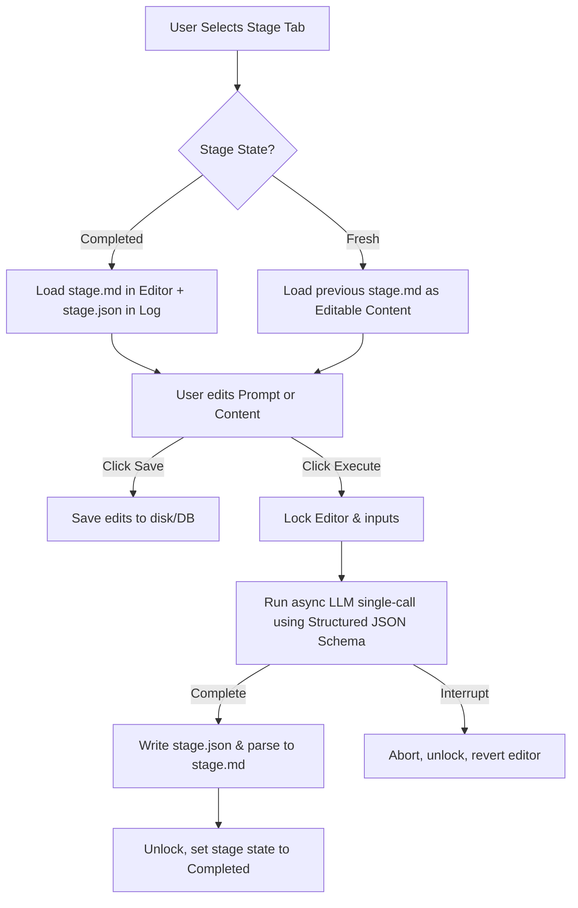

# Pivot Plan: Manual Stage Mode & Structured Outputs

This document outlines the architectural plan to pivot Quill into a flexible, manual-first writing tool. The core design principles are **user control over prompt execution**, **conflict prevention via UI locking**, **full visibility of intermediate stage history**, and **schema-guaranteed JSON outputs** using Pydantic.

---

## 1. Core Objectives

1. **Flexible Manual Mode**:
   * Users can enter any stage (even starting from the middle).
   * Users can review and edit the rendered Jinja prompt for any stage before execution.
   * "Run Agent" becomes "Execute", running a single LLM call asynchronously.
   * The editor and prompts lock during execution to prevent conflicts.
   * Interrupting execution aborts the process and reverts the editor to its previous state.

2. **Stage Elevation & Removal of Two-Call**:
   * All "two-call" stages (generate + evaluate) are split/elevated into distinct, single-call stages.
   * All stages run exactly one LLM call. Automatic loop-back is removed.
   * Alternating stages of Generation and Review/Feedback are placed at the same pipeline level.

3. **Transition to Pydantic Structured Outputs**:
   * All LLM calls across all stages return schema-guaranteed JSON matching specific Pydantic schemas.
   * Robust JSON parsing guarantees no more heuristic regex fallback/cleanup.
   * Simplify artifact file structure: remove `.decision.md`. Every stage produces exactly `<stage>.json` (raw LLM response) and `<stage>.md` (parsed markdown).

4. **Stage History & Progress Inspection**:
   * Stages are classified simply:
     * `fresh`: No artifacts produced yet by this stage.
     * `completed`: Artifacts exist on disk/database.
     * `generating`: Current active stage execution in progress.
   * During and after "Auto Mode" runs, the user can click any stage tab to view its input prompt, raw response JSON, and generated content.

---

## 2. Architectural Design



### A. Pydantic Schemas for Structured Output
All stages will use schema-enforced JSON outputs. We define two primary response shapes:

1. **Content Stages** (`draft`, `revise`, `humanize`, `polish`, `structure`, `outline`):
   ```python
   from pydantic import BaseModel, Field

   class ContentStageOutput(BaseModel):
       content: str = Field(description="The primary markdown text generated by the stage")
       metadata: dict = Field(default_factory=dict, description="Any supplementary metrics, thoughts, or segment data")
   ```

2. **Feedback / Critique Stages** (`review`, `validate`):
   ```python
   from pydantic import BaseModel, Field

   class FeedbackStageOutput(BaseModel):
       critique: str = Field(description="Detailed feedback, annotations, and suggestions")
       suggested_decision: str = Field(description="Recommended decision: 'advance' or 'loop_back'")
   ```

### B. Artifact Files & Directory Structure
Because stages are single-call, every stage writes exactly two files under the piece's directory:
1. **Raw LLM JSON** (`<stage_prefix>_<stage>.json`):
   Saves the raw JSON response payload returned by the LLM (fully validated against the Pydantic schema).
2. **Parsed Markdown Content** (`<stage_prefix>_<stage>.md`):
   * For content stages, contains the text from `ContentStageOutput.content`.
   * For feedback stages, contains the text from `FeedbackStageOutput.critique`.
   * *Note: The `.decision.md` extension is deprecated and removed.*

### C. Python Backend Refactoring
* **Remove Loop-Back Execution**: 
  In [stage_runner.py](file:///home/bob/projects/quill/src/quill/stage_runner.py), remove `run_content_stage` and `evaluate_output`. All LLM execution logic will be routed to a single-call generator method that returns the structured JSON output.
* **Integrate Structured Output in Client**:
  Update [llm.py](file:///home/bob/projects/quill/src/quill/llm.py) to pass the Pydantic schema using LiteLLM (or the configured OpenAI/Gemini compatible client).
* **Bypass Transition Validation**: 
  Modify [pipeline.py](file:///home/bob/projects/quill/src/quill/pipeline.py) so that `validate_transition` does not block out-of-order stage selection. The user has the ultimate capacity to redefine the `current_stage` of a piece.
* **Custom Prompt Run API**:
  Modify `/api/pieces/<piece_id>/run-async` to accept an optional `custom_prompt` body parameter. If present, execute this prompt directly, bypassing Jinja rendering.

### D. Frontend Refactoring ([piece.html](file:///home/bob/projects/quill/src/quill/templates/piece.html) & [piece.js](file:///home/bob/projects/quill/src/quill/static/js/piece.js))
* **Always-Enabled Stage Tabs**: 
  Allow the user to click any stage tab regardless of current progress.
* **Two-Column Layout**:
  * **Left Pane**: Editable prompt panel (Jinja rendered by default). Includes an **Execute** button and a status spinner.
  * **Right Pane**: Content editor panel. Loads the active stage's markdown file. If `fresh`, allows pasting initial text (saved to the preceding stage's file to establish context). Includes a **Save** button.
* **Locking Mechanism**:
  * Set `disabled = true` on the editor textarea, prompt textarea, and save/execute buttons when a run starts.
  * Keep only the **Interrupt** button active.
  * Upon completion or interruption, release the lock (`disabled = false`) and refresh the tab states.
* **Raw Response Inspector**:
  * Add a collapsible panel displaying the pretty-printed JSON file (`<stage_prefix>_<stage>.json`) for the viewed stage.

---

## 3. Implementation Phases

### Phase 1: Structured Output Integration
1. Define Pydantic models for stage responses (`ContentStageOutput` and `FeedbackStageOutput`).
2. Update the LLM client to request structured schema-guaranteed JSON.
3. Update the stage execution engine to parse the returned JSON and write `<stage>.json` and `<stage>.md`.

### Phase 2: Pipeline & Backend Refactoring
1. Update `workflows/default.yaml` to configure all stages as single-call.
2. Remove the internal evaluate loop and loop-back checks from `StageRunner` and `Orchestrator`.
3. Modify `run-async` API to accept `custom_prompt`.
4. Remove/bypass strict stage transition validation.

### Phase 3: Frontend Layout & Locking
1. Restructure [piece.html](file:///home/bob/projects/quill/src/quill/templates/piece.html) to present the prompt text editor side-by-side with the content editor.
2. Update [piece.js](file:///home/bob/projects/quill/src/quill/static/js/piece.js) to dynamically fetch the rendered prompt when navigating tabs.
3. Add the raw JSON viewer to the bottom of the page.
4. Add front-end disable-state toggles for the editor and prompt textareas.
5. Wire the front-end Interrupt button to discard pending changes and restore previous editor text.

### Phase 4: Auto Mode History Inspection & Validation
1. Update SSE listeners to allow background stage updates without locking the navigation tabs.
2. Verify that clicking tabs during or after an auto run successfully pulls the generated files and prompts.
3. Verify backward compatibility with existing pieces.
