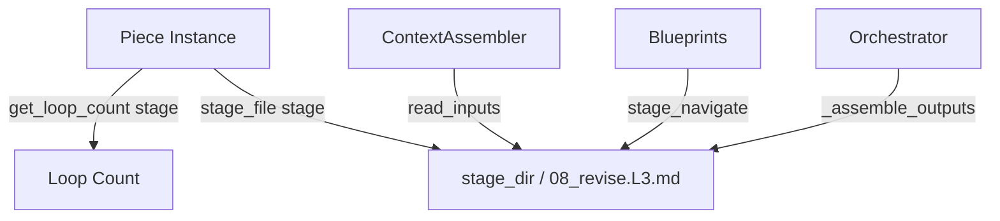

# Design Spec: Propagating Stage Loop Counts for Looped Stages

## Problem Description
In the writing pipeline, some stages (such as `revise` and `polish`) can be executed multiple times. These runs produce versioned files using a loop count suffix, e.g. `08_revise.L3.md` or `12_polish.L1.md`. 
Currently, the codebase contains multiple instances where stage filenames are resolved without specifying the current `loop_count` (which defaults to `0`), resulting in references to non-existent filenames like `08_revise.md`. This causes:
1. The user interface failing to load the content of `revise` and `polish` stages because the backend endpoints check for unversioned files.
2. The `ContextAssembler` failing to locate inputs for subsequent stages (like `humanize` depending on `revise.md`), resulting in a `(no input files found)` message and disconnected generation results.

---

## Proposed Changes

### Approach: Explicit Loop Count Propagation (Approach B)
We will update all critical entry points (blueprints, context assembler, orchestrator, and metrics service) to resolve filenames using the correct `loop_count` for each stage.



---

### Component Modifications

#### 1. Context Assembler (`src/quill/context_assembler.py`)
Modify `read_inputs` to determine and pass the correct loop count for stage-specific inputs and default fallbacks:
- For stage-specific inputs: query `piece.get_loop_count(input_stage_name)` and pass it to `_stage_filename`.
- For default previous stage fallbacks: query `piece.get_loop_count(prev_stage)` and pass it to `_stage_filename`.

#### 2. Blueprints (`src/quill/blueprints/pieces.py` & `src/quill/blueprints/dashboard.py`)
Update files that call `_stage_filename` to load/save markdown content:
- Use `piece.stage_file(stage)` instead of manually constructing the path via `piece.stage_dir() / _stage_filename(stage)`.
- Pass `loop_count` to JSON files loaded in `pieces_stage_navigate`: `_stage_filename(stage, ".json", loop_count=piece.get_loop_count(stage))`.

#### 3. Orchestrator (`src/quill/orchestrator.py`)
Ensure both sliding context building and output concatenation respect the loop count of child/parent pieces:
- In `_build_sliding_context`, look up the loop count for children.
- In `_assemble_outputs`, load the parent piece and child pieces to construct their respective filenames with their correct `loop_count`s.

#### 4. Metrics & Export Services (`src/quill/metrics_service.py` & `src/quill/comic.py` & `src/quill/blueprints/export.py` & `src/quill/run_logger.py`)
- Update `MetricsService` methods to use `piece.stage_file(stage)` or `piece.stage_file(input_stage)` so it correctly calculates metrics on the looped outputs.
- Update `comic.py` and `export.py` to use `piece.stage_file(try_stage)` instead of hardcoded `_stage_filename`.
- Update `run_logger.py` to pass the loop count when generating the debug prompt filename.

---

## Verification Plan

### Automated Tests
Run the test suite using:
```bash
.venv/bin/pytest
```
We will also add target unit tests to verify:
1. `ContextAssembler.read_inputs` correctly resolves a stage-specific input with non-zero loop count.
2. `pieces_stage_navigate` correctly loads a versioned stage file.

### Manual Verification
1. Verify the UI loads the stage text for pieces in the `revise` and `polish` stages.
2. Ensure new runs pass prior stage inputs correctly without showing `(no input files found)`.
